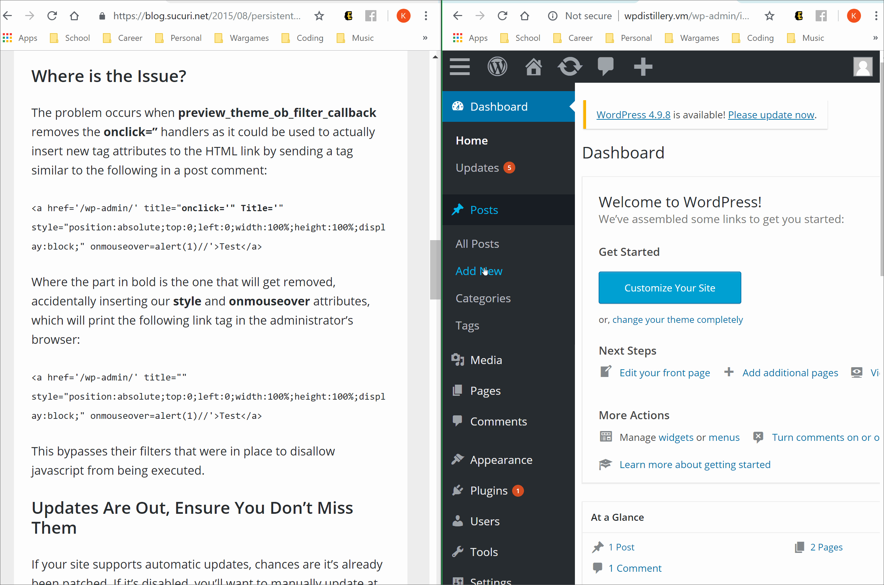

# Project 7 - WordPress Pentesting

Time spent: **3** hours spent in total

> Objective: Find, analyze, recreate, and document **three to five vulnerabilities** affecting an old version of WordPress

## Pentesting Report

1. Authenticated Stored Cross-Site Scripting (XSS)
  - [ ] Summary: 
    - Vulnerability types: XSS
    - Tested in version: <= 4.2.2
    - Fixed in version: 4.2.3
  - [ ] GIF Walkthrough: 
  
  - [ ] Steps to recreate: 
To recreate this exploit, the attacker would first need an account with Contributer or Author
level permissions. They would then make a post and insert the following code in the gif in the content
section:

This proof of concept represents any specially formatted HTML containing JavaScript to be executed
whenever the admin (or anyone) hovers their mouse over the "link".
  - [ ] Affected source code:
2. Authenticated Shortcode Tags Cross-Site Scripting (XSS)
  - [ ] Summary: 
    - Vulnerability types: XSS
    - Tested in version: <= 4.3
    - Fixed in version: 4.2.5
  - [ ] GIF Walkthrough: 
  
  - [ ] Steps to recreate: 
To recreate this exploit, the attacker would first need an account with Contributer or Author
level permissions. They would then make a post and insert the following code in the gif in the content
section:

This proof of concept represents any specially formatted HTML containing JavaScript to be executed
whenever the admin (or anyone) hovers their mouse over the "link".

Similar to the first exploit, this uses "shortcodes" which are non-HTML tags (enclosed by square brackets ‘[]’) that are designed to enable macro content in posts.

  - [ ] Affected source code:
3. Vulnerability Name or ID
  - [ ] Summary: 
    - Vulnerability types: XSS
    - Tested in version: <= 4.2.3
    - Fixed in version: 4.2.4
  - [ ] GIF Walkthrough: 
  
  - [ ] Steps to recreate: 
To recreate this exploit, the attacker would first need an account with Contributer or Author
level permissions. They would then make a post and insert the following code in the gif in the content
section:

This proof of concept exploits the preview_theme() method of Wordpress and with the given tags
will execute the HMTL code in the content upon hovering over the post body.
  - [ ] Affected source code:
    - [Link to Code](https://core.trac.wordpress.org/changeset/33549)

