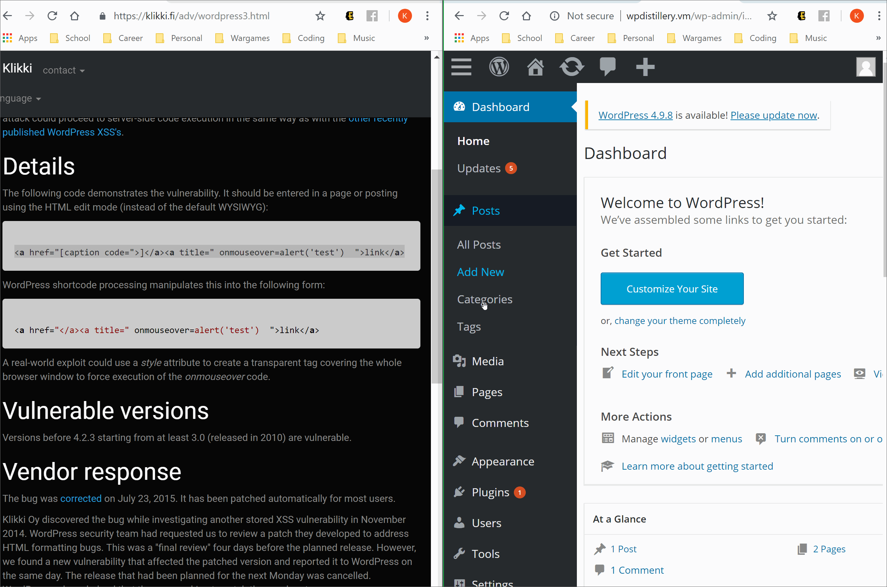
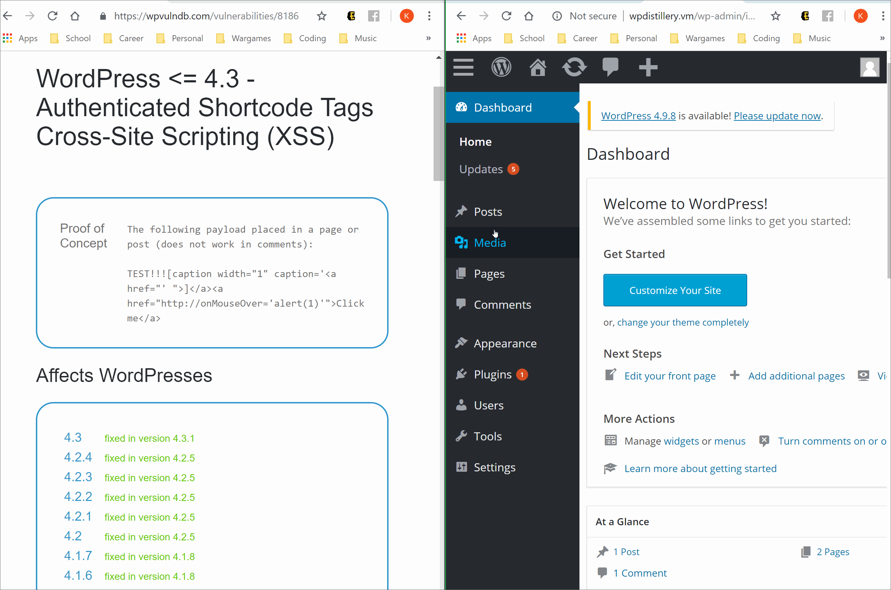

# Project 7 - WordPress Pentesting

Time spent: **X** hours spent in total

> Objective: Find, analyze, recreate, and document **five vulnerabilities** affecting an old version of WordPress

## Pentesting Report

1. Authenticated Stored Cross-Site Scripting (XSS)
  - [ ] Summary: 
    - Vulnerability types: XSS
    - Tested in version: <= 4.2.2
    - Fixed in version: 4.2.3
  - [ ] GIF Walkthrough: 
  
  - [ ] Steps to recreate: 
To recreate this exploit, the attacker would first need an account with Contributer or Author
level permissions. They would then make a post and insert the following code in the content
section:
'''
<a href="[caption code=">]</a><a title=" onmouseover=alert('test')  ">link</a>
'''
This proof of concept represents any specially formatted HTML containing JavaScript to be executed
whenever the admin (or anyone) hovers their mouse over the "link".
  - [ ] Affected source code:
2. Authenticated Shortcode Tags Cross-Site Scripting (XSS)
  - [ ] Summary: 
    - Vulnerability types: XSS
    - Tested in version: <= 4.3
    - Fixed in version: 4.2.5
  - [ ] GIF Walkthrough: 
  
  - [ ] Steps to recreate: 
To recreate this exploit, the attacker would first need an account with Contributer or Author
level permissions. They would then make a post and insert the following code in the content
section:
'''
TEST!!![caption width="1" caption='<a href="' ">]</a><a href="http://onMouseOver='alert(1)'">Click me</a>
'''
This proof of concept represents any specially formatted HTML containing JavaScript to be executed
whenever the admin (or anyone) hovers their mouse over the "link".

Similar to the first exploit, this uses "shortcodes" which are non-HTML tags (enclosed by square brackets ‘[]’) that are designed to enable macro content in posts.

  - [ ] Affected source code:
1. (Required) Vulnerability Name or ID
  - [ ] Summary: 
    - Vulnerability types:
    - Tested in version:
    - Fixed in version: 
  - [ ] GIF Walkthrough: 
  - [ ] Steps to recreate: 
  - [ ] Affected source code:
    - [Link 1](https://core.trac.wordpress.org/browser/tags/version/src/source_file.php)

